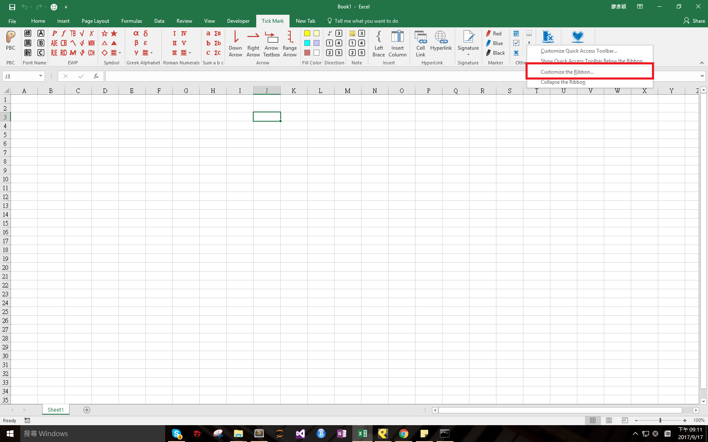
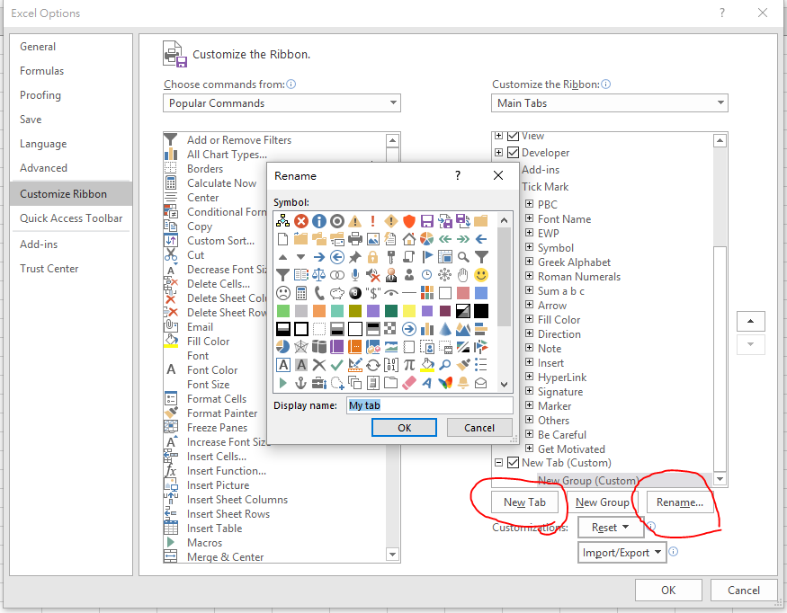
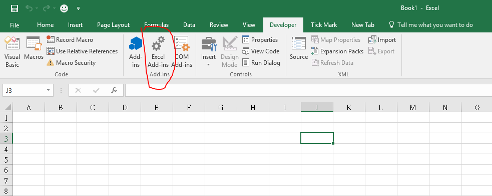
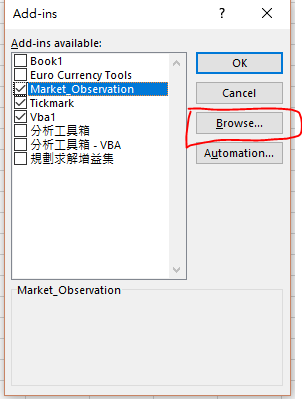
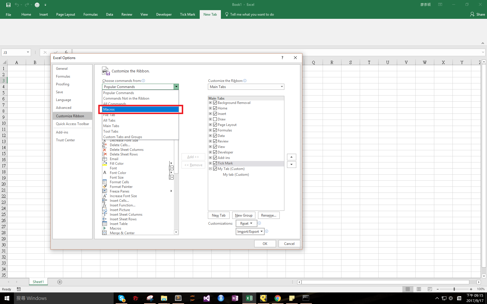
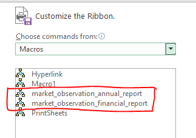
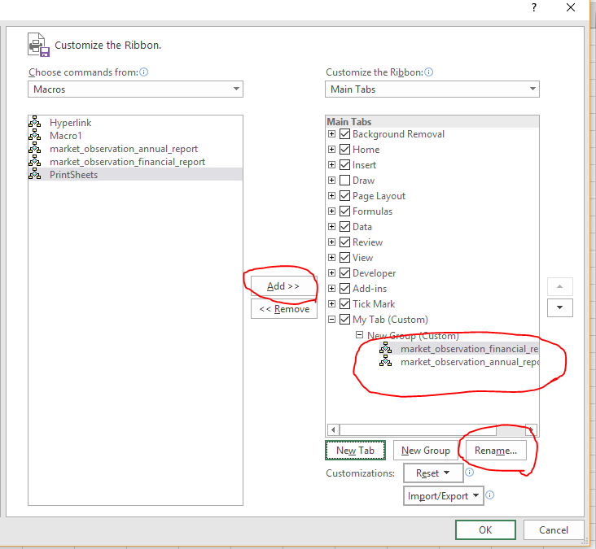
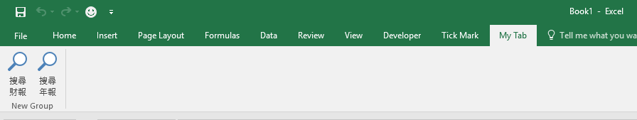
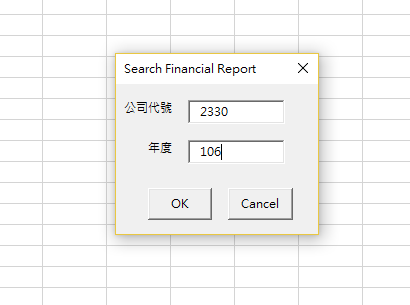

<!--truncate-->

<iframe width="560" height="315" src="https://www.youtube.com/embed/_8ez9G_QCUU" frameborder="0" allowfullscreen></iframe>

1\. Right click any tab on the ribbon

2\. Add a new tab

3\. Open Developer tab and click Excel Add-ins.

4\. Browse your xlam file's path

5\. Open your new tab, customize the ribbon and select macro

6\. Add your own macro to the new tab and rename it.

7\. Results

