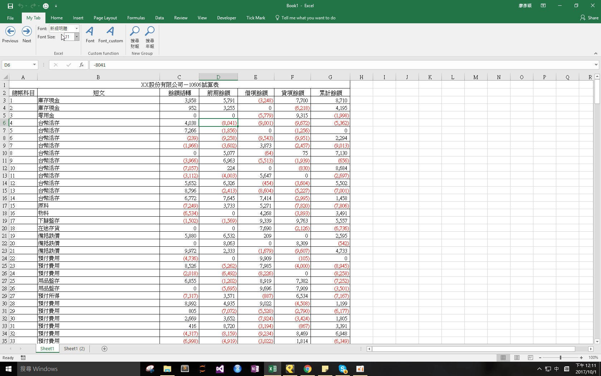

## Download 
[Font.xlam](https://github.com/noworneverev/noworneverev.github.io.old/releases/download/1.2/Font.xlam)

<!--truncate-->

## Demo 


If you don't know how to use xlam file, here's the [tutorial](./excel-customized-ribbon).

You can modify the font name between quotation marks to customize the worksheet with your oftenly used font name and size.

```vb
Sub Font()
    Cells.Select
    Selection.Font.Name = "微軟正黑體"
    Selection.Font.Size = "10"
    ActiveSheet.Range("A1").Select
End Sub
'---------------------------------------
Sub Font_custom()
    Selection.Font.Name = "微軟正黑體"
    Selection.Font.Size = "10"
End Sub
```

