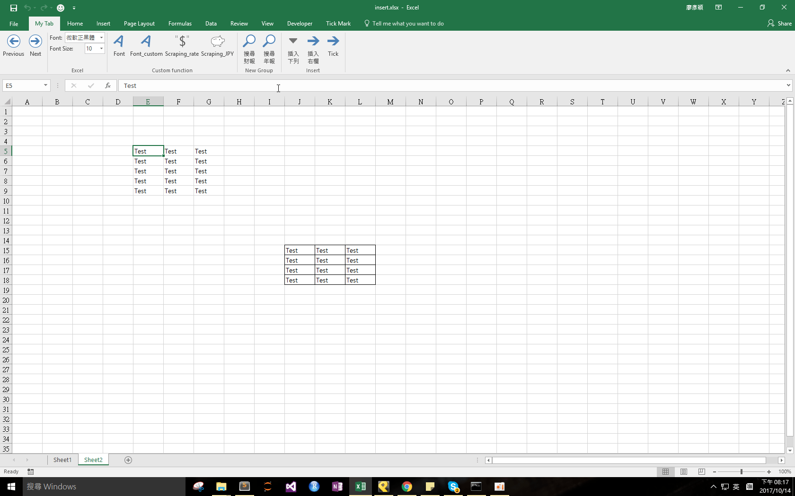

## Download 
[Insert.xlam](https://github.com/noworneverev/noworneverev.github.io.old/releases/download/1.3/insert.xlam)

<!--truncate-->

## Demo 


If you don't know how to use xlam file, here's the [tutorial](./excel-customized-ribbon).

This function aims to help you easily insert columns and rows. Firstly, select a cell and then press the button, if you use the InsertColumn macro, it'll automatically insert a column right besides the cell you selected. Or if you use the InsertRow, it'll add a row below the cell you selected.

There's one more function in the file, inserting a narrow column for tickmark:

```
Sub Insert_Narrow_Column()
    c = Selection.Column
    Cells(1, c + 1).EntireColumn.Insert
    Columns(c + 1).ColumnWidth = 2.1
End Sub
```

You can modify the value of ColumnWidth whatever you want.


