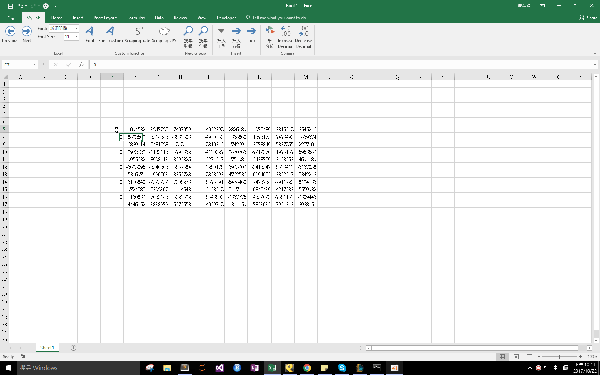

## Download 
[thousands separator.xlam](https://github.com/noworneverev/noworneverev.github.io.old/releases/download/1.4/thousands_separator.xlam)

<!--truncate-->

## Demo 

If you don't know how to use xlam file, here's the [tutorial](./excel-customized-ribbon).

Select a range and format Number with thousands separator but no decimal places.