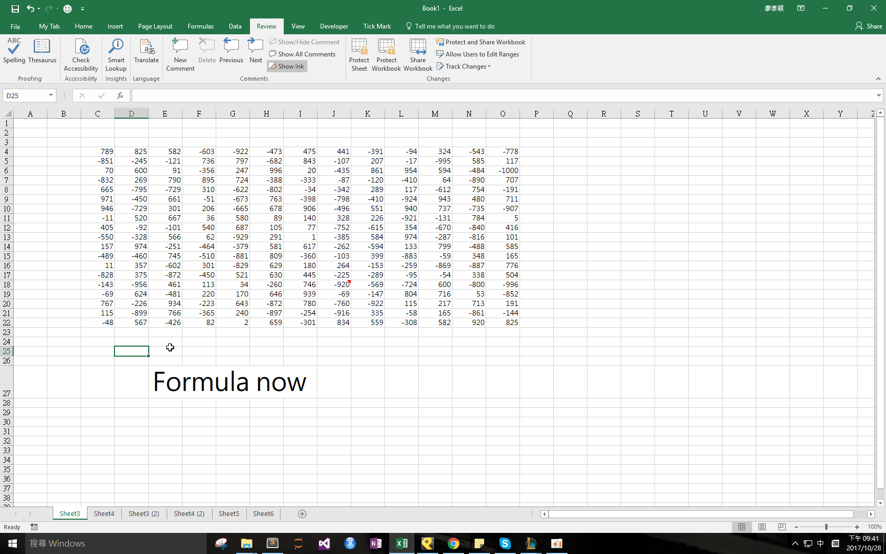

## Download 
[Convert.xlam](https://github.com/noworneverev/noworneverev.github.io/releases/download/1.5/convert.xlam)

<!--truncate-->

## Demo 

If you don't know how to use xlam file, here's the [tutorial](./excel-customized-ribbon).

After the audit team has finished auditing or reviewing, we have to pass working papers to the client. In case the working paper would have referencing errors, it would be safer convert all formula to values. So, this function would make all cells existing in all sheets convert to values, and delete all comments simultaneously.
(Noted that if your workbook has hidden sheets, the macro would not work.)