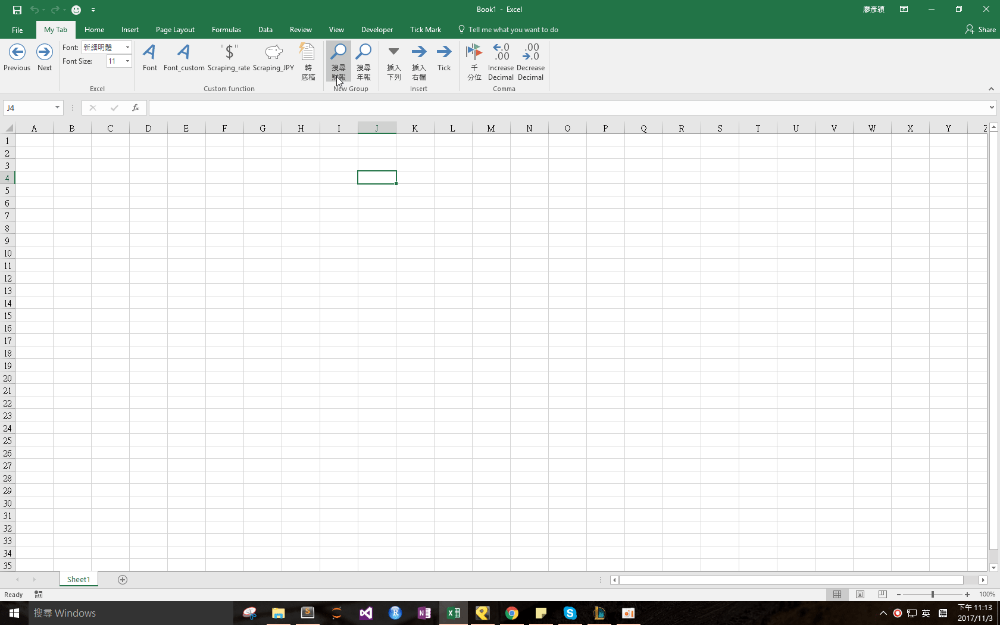

## Download 
[Market Observation.xlam](https://github.com/noworneverev/noworneverev.github.io.old/releases/download/1.0/market_observation.xlam)

<!--truncate-->

## Demo 

If you don't know how to use xlam file, here's the [tutorial](./excel-customized-ribbon).

In Taiwan, there's an official site like EDGAR called Market Observation Post System (公開資訊觀測站) for users to search information of public traded companies. However, sometimes it's hard for users to find their targeting info. As a staff of an accounting firm, financial reports and annual reports are what I need mostly. So I wrote a function in which you can enter the company's code and the year to open your designated pages through Google Chrome.

The default path is ``C:\Program Files (x86)\Google\Chrome\Application\chrome.exe``, if your Google Chrome is not installed in this path, you have to modify it manually.