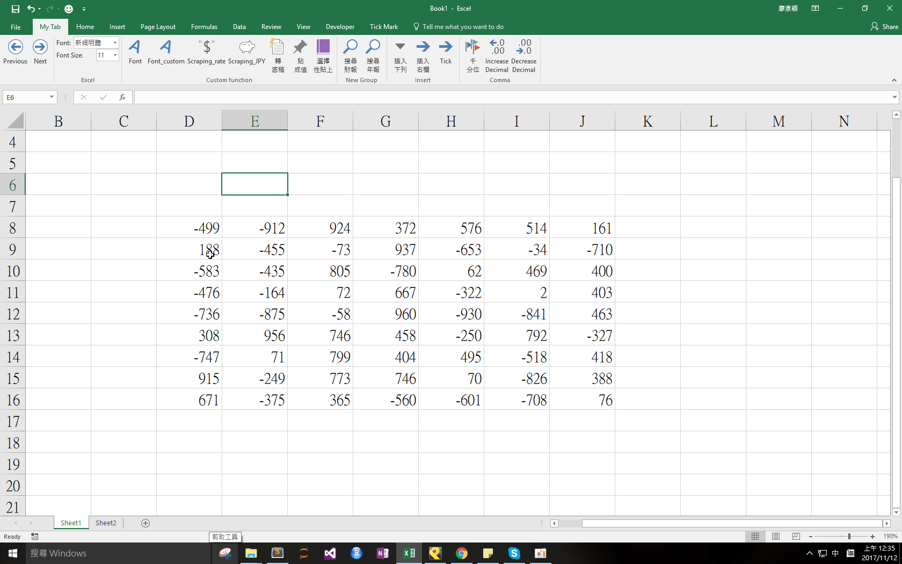

## Download 
[SpecialPaste.xlam](https://github.com/noworneverev/noworneverev.github.io/releases/download/1.7/SpecialPaste_Value.xlam)

<!--truncate-->

## Demo 

If you don't know how to use xlam file, here's the [tutorial](./excel-customized-ribbon).

**This macro has two functions:**
-  ``SpecialPaste_Value`` can convert your selected area into values
-  ``PasteSpecial`` can be used when you want to copy client's PBCs to your working papers and keep its format at the same time. With the customized special pasting add-in, you could paste the data with its original values, column widths and formats.
