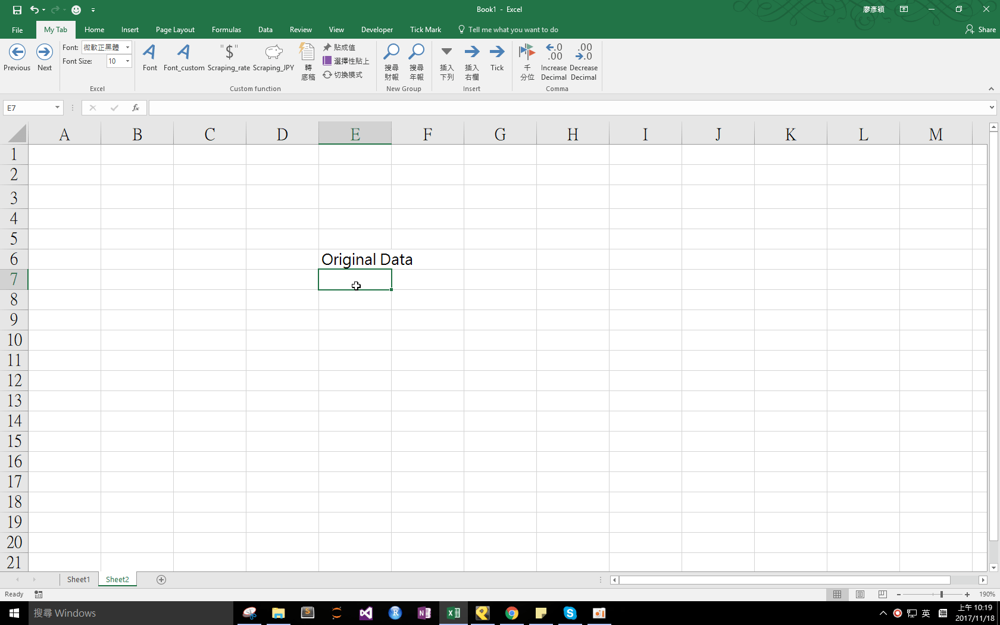

## Download 
[EditDirectinCellandEntertoRight.xlam](https://github.com/noworneverev/noworneverev.github.io/releases/download/1.8/EditDirectinCellandEntertoRight.xlam)

<!--truncate-->

## Demo 

If you don't know how to use xlam file, here's the [tutorial](./excel-customized-ribbon).

In Excel, you can choose whether to allow editing directly in cells or not. If you don't allow it, when you double click a cell existing a referencing formula, Excel will automatically direct to the targeting cell kind of like a hyperlink. And in the other mode, you can directly edit in cells to enter formula or text much more intuitively. With this function, you can easily switch between above two modes depending on what you need.

The other macro EnterMoveSelectionRight can make you switch between moving selection to right and to down, which would be quite useful when you have to switch your return direction frequently.

