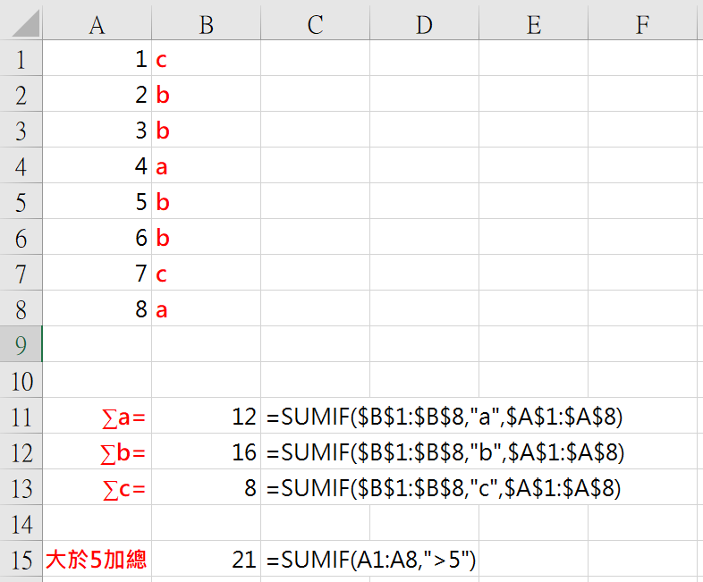
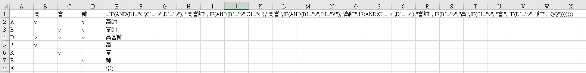

## 原文 
[R: [請益] 事務所的軟體](https://www.ptt.cc/bbs/Accounting/M.1511544733.A.5F1.html)

## 範例檔下載 
[Excel Basics.xlsx](https://github.com/noworneverev/noworneverev.github.io/releases/download/1.9/Basic.Excel.xlsx)

<!--truncate-->

## 快捷鍵：

| #   | 快捷鍵         | 說明           |
|-----|----------------|----------------|
| 1.  | Ctrl + C       | 複製           |
| 2.  | Ctrl + X       | 剪下           |
| 3.  | Ctrl + V       | 貼上           |
| 4.  | Ctrl + Alt + V | 選擇性貼上     |
| 5.  | Ctrl + B 或 + 2| 粗體           |
| 6.  | Ctrl + A       | 全選           |
| 7.  | Ctrl + Z       | 還原           |
| 8.  | Ctrl + F       | 尋找           |
| 9.  | Ctrl + H       | 取代           |
| 10  | Ctrl + P       | 列印           |
| 11. | Ctrl + 1       | 開啟儲存格格式 |
| 12. | Ctrl + D       | 向下填滿       |
| 13. | Ctrl + PgDn    | 下一張工作表   |
| 14. | Ctrl + PgUp    | 上一張工作表   |
| 15. | Alt + =        | 向上加總       |

## 公式

基本概念：
* Excel中冒號(``:``)表連續
* 錢錢符號(``$``)表絕對位置
* 單引號(``'``)會將該儲存格轉成文字格式
* 公式(Function)有幾個前括弧就要有幾個後括弧


### 1. =Sumif(準則範圍, 加總準則, [加總範圍])

   若沒有加總儲存格的範圍，默認加總範圍為準則範圍，例如用"a"這個tickmark來標示你要加總的地方(A1:A4)，把"a"打在如[B1]、[B2]儲存格

| A | B |
|---|---|
| 1 | a |
| 2 | a |
| 3 |   |
| 4 |   |

=Sumif($B:$B, "a", $A:$A) = 3

在打公式時按``F4``將該範圍變成``絕對位置``，如此公式才不會在複製時就跑掉，一般Excel的公式都是``相對位置``，所以例如複製[A11]=Sum(A1:A10)到[B11]時公式會自動變成=Sum(B1:B10)。



   上面Sumif是加總，如果Countif就計數，概念差不多


### 2. =VLOOKUP(你要找的值, 在哪裡找, 回傳第幾欄, 是否完全符合)
用到爛的vlookup，大部分人找值都是用這個函數，無腦又好用

| A | B                                   |
|---|-------------------------------------|
| 1 | =VLOOKUP(A1, $C:$E, 2, FALSE) = PPT |
| 2 | =VLOOKUP(A2, $C:$E, 2, FALSE) = PTT |
| 3 | #N/A                                |
| 4 | #N/A                                |

資料來源：

| C | D   | E |
|---|-----|---|
| 2 | PTT |   |
| 6 |     |   |
| 1 | PPT |   |
| 7 |     |   |

為了避免因為資料來源沒該筆查找資料而跑出#N/A的狀況，我會將公式改寫成``=IFERROR(VLOOKUP(A1, $C:$E, 2, FALSE),"")``，
多個IFERROR來進行錯誤處理，將#N/A變空白""

VLOOKUP還有一個限制是它只能尋找表格陣列最左邊的欄中的值，當然可以自己整理一下表格什麼的處理，不過Excel還有``INDEX``和``MATCH``可以來完美取代VLOOKUP，查找大量資料時經過實測速度也是屌打VLOOKUP


:::note
官方文件：
MATCH 函數會搜尋儲存格範圍中的指定項目，並傳回該項目於該範圍中的相對位置。
例如，若範圍 A1:A3 中含有值 5、25 及 38，則公式 =MATCH(25,A1:A3,0) 會傳回數字
 2，因為 25 是範圍中的第二個項目。
:::

### 3. INDEX的使用方法為：=INDEX(資料來源, 第幾列, 第幾欄)

所以基本的概念就是，用MATCH先找到你的資料是第幾列，再指定你要回傳的欄位，=INDEX(資料來源, MATCH(~~~), 欄位)，範例檔有一個簡易匯率表用INDEX & MATCH來完成可參考。

### 4. =IF(logic_test, if True, if False)

IF公式也是常用的前幾名，IF...Then...ELSE

常搭配AND()公式使用，用作邏輯測試判斷TRUE or False
+ =AND(1=1,2=2,3=3) 傳回TRUE
+ =AND(1=1,2=2,3=2) 傳回FALSE

另外可以寫成巢狀來處理更多的情況，``IF(logic_test, if True, if(logic_test, if True, if(logic_test, if True,false)))``範例檔有一個隨便寫的巢狀公式可參考。


因為Excel公式都要寫成一行，如果真的遇到要寫巢狀公式時，可以拿紙筆出來實際寫較有感覺。

```
IF...THEN
  xxx
ELSE IF
  xxx
ELSE IF
  xxx
ELSE
  xxx
END IF
```