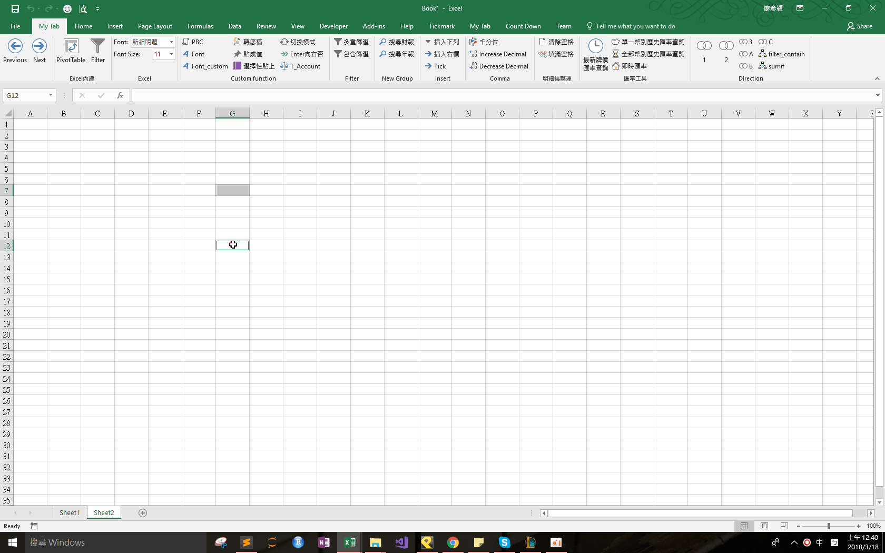

## Download 
[PBC.xlam](https://github.com/noworneverev/noworneverev.github.io.old/releases/download/2.2/PBCv2.xlam)

<!--truncate-->

## Demo 

If you don't know how to use xlam file, here's the [tutorial](./excel-customized-ribbon).

This add-in shows how to insert textboxes to your selected cells. You can modify the code to change whatever the position and the texts you want.
